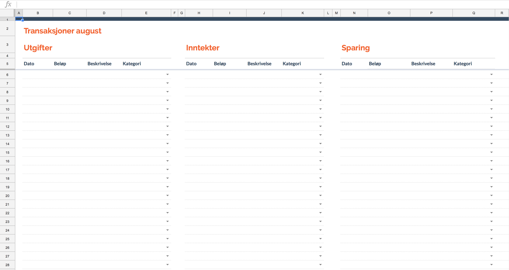

# sbanken-sheets

An application to put bank transactions into a Google Spreadsheets budget.
The application is designed to be used in correlation with the
norwegian bank [Sbanken](www.sbanken.no), who offer an [API](https://sbanken.no/bruke/utviklerportalen/),
and the [this budget](https://docs.google.com/spreadsheets/d/1Nsy5yGLDcpiwNGZaj-SYiiJ7014zettxZgmkDk0vTZc/edit?usp=sharing) created in Google Spreadsheets, along with [their API](https://developers.google.com/sheets/api/).

The snippet of the budget shown above is where the transactions are placed. The column immediately to the left of each date column is used to hold a unique identifier for the transaction.
This will either be a unique id, if made present by the API, or a base64 encoded string of the content of the transaction. In the case of the latter, a count will be done, ensuring that
multiple similar transactions will be inserted multiple times.